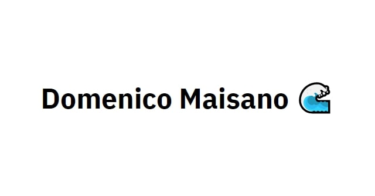

<p align="center">
  <a href="https://dmaisano.netlify.app/">
    
  </a>
</p>

# Personal Site + Blog

Built using [@lekoarts/gatsby-theme-minimal-blog](https://github.com/LekoArts/gatsby-themes/tree/master/themes/gatsby-theme-minimal-blog)

[Original Theme README](https://github.com/LekoArts/gatsby-themes/tree/master/themes/gatsby-theme-minimal-blog)

## Features

- MDX
- Theme UI-based theming
- Light Mode / Dark Mode
- Typography driven, minimal style
- Tags/Categories support
- Code highlighting with [prism-react-renderer](https://github.com/FormidableLabs/prism-react-renderer) and [react-live](https://github.com/FormidableLabs/react-live) support. Also allows adding line numbers, line highlighting, language tabs, and file titles.
- RSS Feed for blog posts

[**View the starter's code**](https://github.com/LekoArts/gatsby-starter-minimal-blog)

## Usage

### Theme options

| Key               | Default Value                                        | Description                                                                                                |
| ----------------- | ---------------------------------------------------- | ---------------------------------------------------------------------------------------------------------- |
| `basePath`        | `/`                                                  | Root url for the theme                                                                                     |
| `blogPath`        | `/blog`                                              | url for the blog post overview page                                                                        |
| `tagsPath`        | `/tags`                                              | url for the tags overview page and prefix for tags (e.g. `/tags/my-tag`)                                   |
| `postsPath`       | `content/posts`                                      | Location of posts                                                                                          |
| `postsPrefix`     | `/`                                                  | Prefix for all individual blog posts                                                                       |
| `pagesPath`       | `content/pages`                                      | Location of additional pages (optional)                                                                    |
| `mdx`             | `true`                                               | Configure `gatsby-plugin-mdx` (if your website already is using the plugin pass `false` to turn this off)  |
| `formatString`    | `DD.MM.YYYY`                                         | Configure the date format for Date fields                                                                  |
| `showLineNumbers` | `true`                                               | Show line numbers in code blocks                                                                           |
| `showCopyButton`  | `true`                                               | Show copy button in code blocks                                                                            |
| `navigation`      | `[]`                                                 | Add links to your internal sites to the left part of the header                                            |
| `externalLinks`   | `[]`                                                 | Add links to your external sites to the right part of the header                                           |
| `feed`            | `true`                                               | Configure `gatsby-plugin-feed` (if your website already is using the plugin pass `false` to turn this off) |
| `feedTitle`       | `Minimal Blog - @lekoarts/gatsby-theme-minimal-blog` | Pass a string to the `title` option of `gatsby-plugin-feed`                                                |

#### Example usage

```js
// gatsby-config.js
module.exports = {
  plugins: [
    {
      resolve: `@lekoarts/gatsby-theme-minimal-blog`,
      options: {
        showLineNumbers: false,
        navigation: [
          {
            title: `Blog`,
            slug: `/blog`,
          },
          {
            title: `About`,
            slug: `/about`,
          },
        ],
        externalLinks: [
          {
            name: `Twitter`,
            url: `https://twitter.com/lekoarts_de`,
          },
          {
            name: `Instagram`,
            url: `https://www.instagram.com/lekoarts.de/`,
          },
        ],
      },
    },
  ],
}
```

#### Additional configuration

In addition to the theme options, there are a handful of items you can customize via the `siteMetadata` object in your site's `gatsby-config.js`

```js
// gatsby-config.js
module.exports = {
  siteMetadata: {
    // Used for the title template on pages other than the index site
    siteTitle: `Lupin`,
    // Default title of the page
    siteTitleAlt: `Minimal Blog - @lekoarts/gatsby-theme-minimal-blog`,
    // Can be used for e.g. JSONLD
    siteHeadline: `Minimal Blog - Gatsby Theme from @lekoarts`,
    // Will be used to generate absolute URLs for og:image etc.
    siteUrl: `https://minimal-blog.lekoarts.de`,
    // Used for SEO
    siteDescription: `Typography driven, feature-rich blogging theme with minimal aesthetics. Includes tags/categories support and extensive features for code blocks such as live preview, line numbers, and line highlighting.`,
    // Will be set on the <html /> tag
    siteLanguage: `en`,
    // Used for og:image and must be placed inside the `static` folder
    siteImage: `/banner.jpg`,
    // Twitter Handle
    author: `@lekoarts_de`,
  },
}
```
