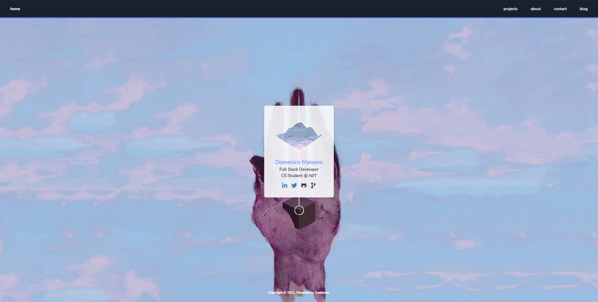
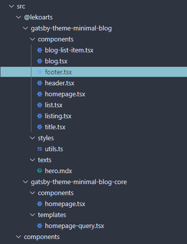

First and foremost I want to give credit to [@LekoArts](https://github.com/LekoArts) for creating his original theme, [link here](https://www.gatsbyjs.com/starters/LekoArts/gatsby-starter-minimal-blog).

Back in 2019 I put together a small [portfolio site](https://old-site.dmaisano.dev) to showcase a few projects, have a simple "about me" section, and a contact form using [netlify forms](https://docs.netlify.com/forms/setup), since both that site and this one are hosted on [Netlify](https://www.netlify.com/). At the time I was using [Gridsome](https://gridsome.org) which was a Vue.js alternative to Gatsby. That project was ultimately never fully completed.

<ImgComment>Landing page for my old site</ImgComment>

I got the idea to redesign my site from scratch after I had completed some projects and tutorials, with the extra free time the covid quarantine provided me with. I originally thought it would be a fun idea to make my blog from scratch and try to avoid using any existing existing Gatsby projects as a base for my project. After spending time prototyping pages, layouts, and trying to put together a cohesive design system I realized it would take a lot of time and effort to have a final product that I would be comfortable publishing. I went back to the drawing board and decided to work with an existing Gatsby Theme that had a good UI/UX to my liking and use that as a starting point for the blog. Which led to me to the decision on using LekoArts' Minimal Blog Starter which was ranked highly in relevance on the Gatsby Starters page.

After cloning the project and digging around through the files I decided I would make some changes to the UI that better suited the design I had in my head. The first thing I did was strip away the light and dark mode toggle as I thought it was a bit overkill. I made use of the [Gatsby Shadowing API](https://www.gatsbyjs.com/docs/how-to/plugins-and-themes/shadowing/) to overwrite and tweak components and files as needed. As I found myself customizing more and more components I began notice that I was overwriting, copy and pasting the original source code for each individual component, and making my modifications from there. The Gatsby theme I was using was essentially two themes in one, a theme built on top of a core theme that exposed minimal functionality. I began to think about the feasibility of continuing this approach; I wondered if there would be adjustments needed on my part as updates to the two themes came out over time, and would require my intervention. What if breaking changes could be introduced with conflicting packages or mismatching versions of Gatsby or React were introduced over time.

<ImgComment>Folder structure using shadowing</ImgComment>

My compromise was to opt out of using a Gatsby theme altogether. I figured stepping away from the Shadowing API would lead to a less painful experience whenever I need to upgrade Gatsby or other project dependencies. I also have the benefit of having all the code for each component and underlying logic available to me in project explorer without having to inspect and go to definition to view the original code.

This brings us into the present where I've published my blog. I'm sure that I will continue to make tweaks and adjustments, or new features that might be missing from the site as time goes on.

Overall working on this project proved to still be a fun and humbling experience. Despite being out of school, I find that working in the field of Computer Programming / Software Engineering there's always more to learn and you can never truly know everything.
